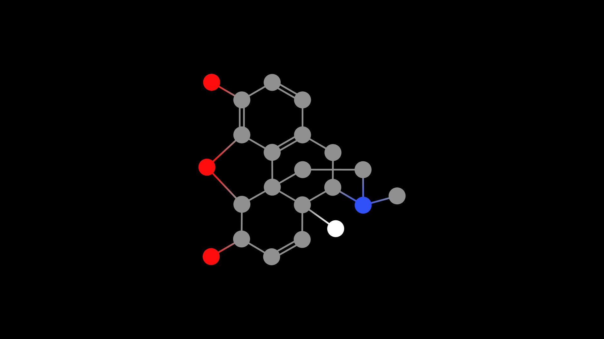

# Drawing a molecule
Manim Chemistry uses [.mol](https://chem.libretexts.org/Courses/University_of_Arkansas_Little_Rock/ChemInformatics_(2017)%3A_Chem_4399_5399/2.2%3A_Chemical_Representations_on_Computer%3A_Part_II/2.2.2%3A_Anatomy_of_a_MOL_file), .sdf, .json, .asnt and xml files to get atoms and bonds in an easy way. You can also use identifiers from [PubChem](https://pubchem.ncbi.nlm.nih.gov/) to get the desired structure.

Check out the [philosophy](/philosophy) entry to know more about why we do this that way.

## Using a file
You can use mol, sdf, json, asnt and xml formats to draw your molecules.

As per this quickstart guide, you can simply the example [morphine 2d](../../../examples/molecule_files/mol_files/morphine_2d.mol) molfile and use it.

## MMoleculeObjects

You can create a MMoleculeObject Using a mol file and the static method `molecule_from_file` and then perform all your animations as you would with any MObject:

```python
from manim import *
from manim_chemistry import *

class TwoDMoleculeScene(Scene):
    def construct(self):
        morphine = MMoleculeObject.molecule_from_file("morphine_2d.mol", ignore_hydrogens=False)
        self.add(morphine)
```


As you can see, it is pretty ugly and can be improved. Go check the [MMoleculeObject] section to see how to solve it and improve your drawings.

```{attention}
I set the `ignore_hydrogens` parameter to `False` because, otherwise, we would not be able to see all the hydrogens. Its default value is `True`. You can remove all the hydrogens using `ignore_all_hydrogens=True`
```


## GraphMolecules: The beautiful ones

Normal MMoleculeObjects follow the common structure of academia. GraphMolecules are a little bit less correct but they are way prettier.

Also, they inherit from Manim's [`Graph`](https://docs.manim.community/en/stable/reference/manim.mobject.graph.Graph.html), which itself inherits from a [networkx graph](https://networkx.org/documentation/stable/reference/classes/graph.html). All this inheritance makes easier to animate and explore more functionality.

Similarly to what you can do with MMoleculeObjects, you can use mol files to create a GraphMolecule:

```python
from manim import *
from manim_chemistry import *

class GraphMoleculeExample(Scene):
    def construct(self):
        graph_molecule = GraphMolecule.molecule_from_file("morphine_2d.mol", ignore_hydrogens=False)
        self.add(graph_molecule)
```


### Rotating and changing molecule colors.

One of the powerful tools of graphs is the possibility of selecting atoms and bonds that branch from a certain bond in a certain direction. This, combined with Manim, helps us to animate rotations, movements and color changes of certain parts of the molecule using GMAnimationBuilder:

```{attention}
In this example we are using the [dimethylpropane.mol](../../../examples/molecule_files/mol_files/dimethylpropane.mol) file.
```


```python
from manim import *
from manim_chemistry import *

class GraphMoleculeExample(Scene):
    def construct(self):
        molecule = GraphMolecule.molecule_from_file("dimethylpropane.mol", label=True, numeric_label=True, ignore_hydrogens=False)
        atoms_and_bonds = molecule.get_connected_atoms_and_bonds(1, 3)
        animation_builder = GMAnimationBuilder(
            molecule=molecule, atoms=atoms_and_bonds[0], bonds=atoms_and_bonds[1]
        )
        self.add(molecule)
        self.wait()
        self.play(animation_builder.rotate_atoms_about_bond(1, 3))
        self.wait()
        self.play(
            animation_builder.change_color(
                atoms_color=BLUE, bonds_color=RED, label_color=PINK
            )
        )
        self.wait()

```


## ThreeDMolecules
Using the opengl renderer, we can achieve drawing a molecule in three d. All we need are three things:
1. Run the animation using the `opengl` renderer.
2. A molecule data file (just like before). In This case, I recommend using the [morphine 3d](../../../examples/molecule_files/mol_files/morphine_3d.mol) file.

```python
from manim import *
from manim_chemistry import *

config.renderer = "opengl" # You can set this here or as a flag when running manim.
class Draw3DMorphine(ThreeDScene):
    def construct(self):
        three_d_morphine = ThreeDMolecule.molecule_from_file("morphine_3d.mol", ignore_hydrogens=False)
        self.add(three_d_morphine)
        self.wait()
```

You can also use a csv data file with data for your atoms to customize them. It should contain the following data in the columns:
    - AtomicNumber
    - Name
    - Symbol
    - AtomicMass
    - Color

[Here](../../../assets/Elements_EN.csv) you can download an example of the data file and [there](../../../examples/element_files/morphine3d.mol) you can get the morphine 3d structure to use as an example.

```{attention}
Remember to use the opengl renderer:
`manim .\examples.py Draw3DMorphine -ps --renderer=opengl`
```
Here is the result!


## Using the PubChem API connection
You can use molecules directly from PubChem by providing a correct identifier. Accepted identifiers are `cid`, `name`, `smiles`, and `inchi`:

```python
class MoleculeFromPubchemScene(Scene):
    def construct(self):
        molecule = GraphMolecule.molecule_from_pubchem(name="morphine")
        self.add(molecule)
```

You can also get the 3D versions of those molecules by setting `three_d=True`

```
from manim import *
from manim_chemistry import *

config.renderer = "opengl"
class MoleculeFromPubchemScene(Scene):
    def construct(self):
        molecule = ThreeDMolecule.molecule_from_pubchem(name="morphine", three_d=True)
        self.add(molecule)
```
